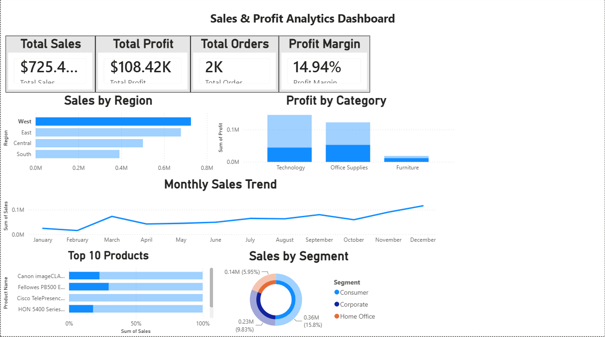

# Sales-Performance-Dashboard
## Project Overview
This project focuses on analyzing retail sales data using Power BI. The dashboard was created to track business performance through key metrics such as sales, profit, customer trends, and regional performance. The goal was to transform raw sales data into meaningful insights that can support business decision-making.
## Objective
The objective of this project was to:

* Monitor overall sales and profit performance
* Identify top-performing products and regions
* Analyze customer purchasing trends
* Track business growth over time
* Present insights through interactive visualizations
## Tools Used
* Power BI
* Microsoft Excel
## Key Performance Indicators (KPIs)
* Total Sales
* Total Profit
* Profit Margin
* Total Orders
* Customer Count
* Average Sales per Order
## Dashboard Features
* Interactive filters and slicers
* Regional sales analysis
* Category and sub-category performance analysis
* Monthly sales trend analysis
* Profitability analysis
* Customer performance tracking
* Dynamic KPI cards
## Analysis Performed

### Sales Analysis
Analyzed total sales across different regions, categories, and products to identify areas contributing the highest revenue.
### Profit Analysis
Compared sales and profit performance to understand which products and regions generated the most profit.
### Trend Analysis
Examined monthly sales patterns to identify growth trends and seasonal fluctuations.
### Customer Analysis
Evaluated customer purchasing behavior and contribution to overall business performance.
## Key Insights
* Identified the highest-performing regions based on sales revenue.
* Determined product categories contributing the most profit.
* Observed sales trends across different time periods.
* Highlighted customer segments driving business growth.
* Identified opportunities to improve profitability through product-level analysis.
## Files Included
* Sales_Performance_Dashboard.pbix
* Sales Dataset
* Dashboard Screenshot
* README.md
## Dashboard Preview

## Skills Demonstrated
* Power BI Dashboard Development
* Data Cleaning
* Data Visualization
* KPI Reporting
* Sales Analysis
* Business Intelligence
* Trend Analysis
* Data Interpretation
## Conclusion
This project demonstrates how Power BI can be used to convert raw sales data into interactive dashboards and actionable business insights. The dashboard enables users to monitor performance, identify trends, and make data-driven decisions effectively.

